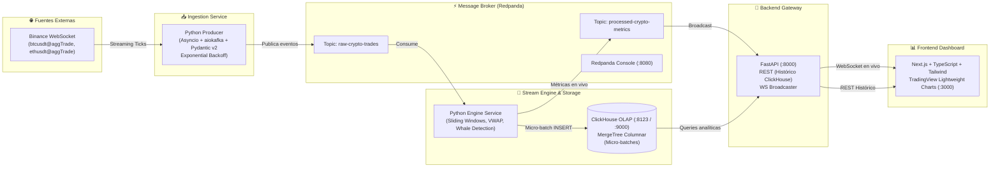

# ⚡ CryptoPulse Stream: Plataforma de Inteligencia Financiera en Streaming (Event-Driven)

[](https://www.python.org/)
[](https://redpanda.com/)
[](https://clickhouse.com/)
[](https://www.docker.com/)
[](https://github.com/astral-sh/ruff)
[](LICENSE)

Plataforma de procesamiento analítico en tiempo real diseñada con arquitectura reactiva orientada a eventos (**Event-Driven Architecture**). El sistema ingesta ticks continuos de mercado desde **Binance WebSockets**, los valida con esquemas estrictos de **Pydantic v2**, los publica en **Redpanda** (C++ zero-JVM) y los prepara para agregaciones en memoria y persistencia masiva columnar en **ClickHouse**.

---

## 🏛️ Arquitectura del Sistema



---

## 💡 Decisiones de Ingeniería y Arquitectura

| Componente | Elección Técnica | Justificación Técnica |
| :--- | :--- | :--- |
| **Broker** | **Redpanda** | Compatible 100% con la API de Kafka, desarrollado en C++ sin el overhead de memoria ni las pausas de recolección de basura (GC) de la JVM. Reduce drásticamente la latencia y levanta en segundos en entornos locales o Kubernetes. |
| **Ingesta** | **Asyncio + aiokafka + orjson** | Conexión WebSocket no bloqueante con reconexión automática (*Exponential Backoff*). Serialización ultra-rápida con `orjson` en C y contratos de datos inmutables con Pydantic v2. |
| **OLAP Storage** | **ClickHouse** | Base de datos analítica columnar con compresión avanzada (`Gorilla`, `DoubleDelta`, `ZSTD`). Optimizada para soportar ingestas masivas mediante micro-batches y responder queries analíticas de series temporales en milisegundos. |
| **Gateway & WS** | **FastAPI** | Soporte dual nativo: endpoints REST para histórico de velas y WebSockets de baja latencia con background workers para distribución reactiva a clientes. |
| **Visualización** | **TradingView Lightweight Charts** | La biblioteca de gráficos financieros de referencia en la industria financiera por su fluidez a 60 FPS con actualización tick a tick. |

---

## 📦 Estructura del Repositorio

```text
crypto-pulse-stream/
├── .github/
│   └── workflows/ci.yml         # CI/CD: Linters (ruff) y validación de tipos
├── docker-compose.yml           # Orquestación unificada de infraestructura y servicios
├── .env.example                 # Variables de entorno documentadas
├── .gitignore                   # Exclusión estricta de secretos y volúmenes
├── pyproject.toml               # Configuración central de linters y pruebas
├── infra/
│   └── clickhouse/
│       └── init_db.sql          # DDL de tablas MergeTree y esquemas analíticos
└── services/
    └── producer/                # Microservicio de ingesta Binance -> Redpanda
        ├── Dockerfile
        ├── requirements.txt
        └── src/
            ├── main.py          # Worker asíncrono con exponential backoff
            ├── config.py        # Configuración tipada con Pydantic Settings
            └── schemas.py       # Modelos de datos estrictos (Pydantic v2)
```

---

## 🚀 Inicio Rápido (Quickstart)

El proyecto está diseñado para levantarse con **un solo comando**:

### 1. Clonar el repositorio
```bash
git clone https://github.com/HugoGarmon/crypto-pulse-stream.git
cd crypto-pulse-stream
```

### 2. Configurar variables de entorno
```bash
cp .env.example .env
```

### 3. Desplegar con Docker Compose
```bash
docker compose up -d --build
```

### 4. Monitorizar el flujo en tiempo real
- **Redpanda Console**: Abre tu navegador en [http://localhost:8080](http://localhost:8080) para inspeccionar los topics, particiones y tasa de mensajes en vivo.
- **ClickHouse HTTP**: Accesible en `http://localhost:8123` (Nativo en `9000`).

Para ver los logs del productor ingiriendo datos de Binance:
```bash
docker compose logs -f producer
```

---

## 📊 Formato de Datos del Stream

Cada transacción individual agregada de Binance es validada, enriquecida y serializada en el topic `raw-crypto-trades`:

```json
{
  "symbol": "BTCUSDT",
  "price": 75936.00,
  "quantity": 0.00047,
  "volume_usd": 35.6899,
  "is_buyer_maker": true,
  "trade_id": 4065134441,
  "timestamp": 1789551456341,
  "received_at": 1789551456460
}
```

---

## 🗺️ Roadmap de Desarrollo

- [x] **Fase 0: Setup Inicial del Repositorio** (Git, Gitignore, `.env.example`, estándares PEP 8 con `ruff`).
- [x] **Fase 1: Infraestructura Base** (Redpanda cluster, Redpanda Console :8080, ClickHouse OLAP y tablas `MergeTree`).
- [x] **Fase 2: Ingesta en Streaming Resiliente** (Producer asíncrono con WebSockets de Binance, tipado Pydantic v2, reconexión automática y particionado por par en Redpanda).
- [ ] **Fase 3: Stream Processor & Persistencia OLAP** (Cálculo de VWAP en memoria, ventanas deslizantes de 1m, detección de ballenas y micro-batching a ClickHouse).
- [ ] **Fase 4: Backend API & WebSocket Gateway** (FastAPI REST para histórico + WebSocket broadcaster).
- [ ] **Fase 5: Frontend Dashboard en Tiempo Real** (Next.js, TailwindCSS y TradingView Lightweight Charts).
- [ ] **Fase 6: Benchmarking & CI/CD** (Pruebas de estrés +3.000 ops/sec y GitHub Actions).

---

## 👨‍💻 Autor

**Hugo Garmón**
- GitHub: [@HugoGarmon](https://github.com/HugoGarmon)
- LinkedIn: [Hugo Garmón](https://www.linkedin.com/)

---

## 📄 Licencia

Este proyecto está bajo la Licencia MIT. Consulta el archivo [LICENSE](LICENSE) para más detalles.
